# UNSLOP Runtime Layers

## 핵심 관점

UNSLOP은 AI가 만든 UI를 “AI처럼 안 보이게” 바꾸는 도구가 아니다.

UNSLOP은 다음 질문에 답하는 **product readiness gate**다.

> 이 화면은 실제 제품으로 검토 가능한가?

따라서 레이어는 다음 순서로 설계한다.

```txt
Input
  -> Render / Parse
  -> Product Context Enrichment
  -> Signal Extraction
  -> Rule + Signature Evaluation
  -> Score + Quality Gate
  -> Fix Plan / Agent Dispatch
  -> Persistent Artifacts
  -> Re-run / Human Review / CI Decision
```

---

## 1. 참조 이미지 스타일 전체 도식

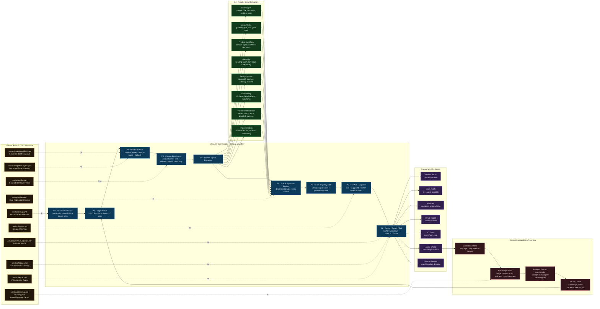

---

## 2. 레이어 스택 도식

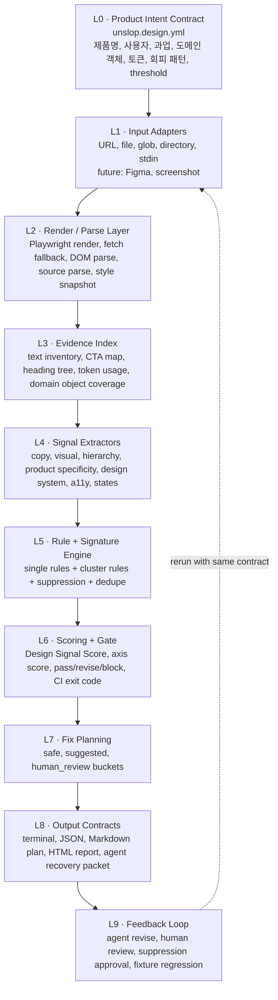

---

## 3. 8 Phase Workflow

| Phase | 이름                   | 핵심 질문                       | 입력                          | 출력                          |
| ----- | -------------------- | --------------------------- | --------------------------- | --------------------------- |
| P0    | Init / Contract Load | 이 프로젝트의 제품 의도는 무엇인가?        | `unslop.design.yml`         | `AuditConfig`               |
| P1    | Target Intake        | 무엇을 검사할 것인가?                | URL, file, glob, dir, stdin | `TargetEnvelope`            |
| P2    | Render / Parse       | 실제 화면과 소스에서 무엇을 볼 수 있는가?    | target                      | DOM, source, computed style |
| P3    | Context Enrichment   | 제품 과업과 화면 증거를 어떻게 연결할 것인가?  | config + snapshots          | `EvidenceIndex`             |
| P4    | Signal Extraction    | 어떤 slop 신호가 있는가?            | evidence                    | `Signal[]`                  |
| P5    | Rule / Signature     | 단일 문제가 아니라 slop cluster인가?  | signals + rules             | `Finding[]`                 |
| P6    | Score / Gate         | pass, revise, block 중 무엇인가? | findings + thresholds       | `AuditResult`               |
| P7    | Fix Plan / Dispatch  | 무엇부터 고쳐야 하는가?               | findings                    | safe/suggested/human_review |
| P8    | Persist / Report     | 사람, CI, agent가 무엇을 읽어야 하는가? | result                      | JSON, MD, HTML, exit code   |

---

## 4. Phase별 상세 설계

### P0 · Init / Product Intent Contract

UNSLOP의 핵심 설정 파일은 단순 config가 아니라 **제품 의도 계약서**다.

```yaml
# unslop.design.yml
product:
  name: "DOTORE TOPIK"
  type: "education"
  primary_user: "TOPIK learners"
  primary_tasks:
    - solve TOPIK questions
    - review wrong answers
    - track vocabulary mistakes

domain:
  objects:
    - question
    - wrong answer
    - vocabulary
    - grammar pattern
    - mock test
    - score report

brand:
  avoid_visuals:
    - neon glow
    - purple cyan gradient
    - decorative orb without product meaning
  avoid_copy:
    - "Get Started"
    - "Learn More"
    - "Unlock your potential"
    - "AI-powered insights"

tokens:
  colors:
    surface: "#ffffff"
    foreground: "#111111"
  spacing: [0, 4, 8, 12, 16, 24, 32, 48, 64]
  radius:
    sm: 6
    md: 10
    lg: 16

thresholds:
  design_signal: 75
  accessibility: 85

gates:
  fail_on_blocking: true
  fail_on_high: false

ignore:
  - rule_id: generic-cta-get-started
    target: "src/app/page.tsx"
    reason: "Temporary launch CTA approved by product."
```

핵심은 이 파일이 “취향”이 아니라 다음 판단 기준을 제공한다는 점이다.

```txt
제품 사용자
제품 과업
도메인 객체
브랜드 회피 패턴
디자인 토큰
품질 threshold
승인된 예외
```

---

### P1 · Target Intake

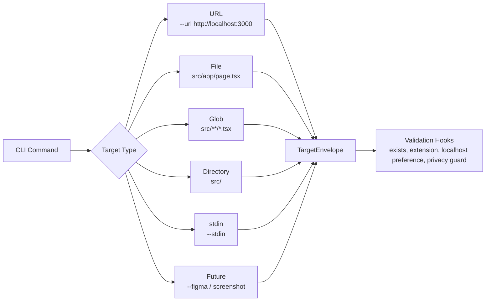

TargetEnvelope 예시:

```ts
type TargetEnvelope =
  | {
      kind: "url";
      target: string;
      preferBrowserRender: true;
      fallback: "fetch";
    }
  | {
      kind: "files";
      files: Array<{
        path: string;
        extension: string;
        content: string;
      }>;
    }
  | {
      kind: "stdin";
      content: string;
      declaredType?: "html" | "tsx" | "text";
    };
```

---

### P2 · Render / Parse

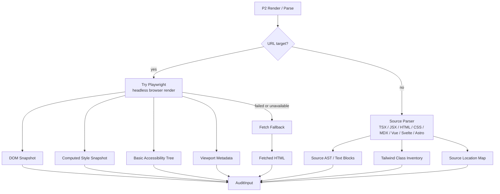

AuditInput의 목표는 “화면을 본 것처럼” 검사할 수 있는 중립 표현을 만드는 것이다.

```ts
type AuditInput = {
  target: {
    kind: "url" | "files" | "stdin";
    label: string;
  };

  rendered?: {
    html: string;
    text: string[];
    viewport: {
      width: number;
      height: number;
    };
    computedElements: ComputedElementSnapshot[];
    accessibilityHints: AccessibilityHint[];
  };

  source?: {
    files: SourceFile[];
    classNames: TailwindClassUsage[];
    literals: TextLiteral[];
    sourceMap: SourceLocationMap;
  };

  metadata: {
    createdAt: string;
    adapter: "playwright" | "fetch" | "source" | "stdin";
    warnings: string[];
  };
};
```

---

### P3 · Context Enrichment

P3는 UNSLOP의 핵심이다. 여기서 단순 lint가 아니라 **제품 증거 검사**로 바뀐다.

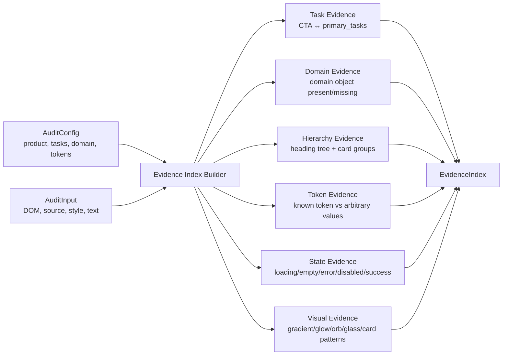

EvidenceIndex 예시:

```ts
type EvidenceIndex = {
  product: {
    name?: string;
    primaryUser?: string;
    primaryTasks: string[];
    domainObjects: string[];
  };

  text: {
    headings: TextNodeEvidence[];
    ctas: TextNodeEvidence[];
    labels: TextNodeEvidence[];
    genericPhrases: TextNodeEvidence[];
  };

  visual: {
    gradients: VisualEvidence[];
    glows: VisualEvidence[];
    glassCards: VisualEvidence[];
    decorativeOrbs: VisualEvidence[];
  };

  hierarchy: {
    headingOrder: HeadingNode[];
    repeatedCardGroups: CardGroupEvidence[];
    primaryActionCount: number;
  };

  system: {
    tokenMatches: TokenEvidence[];
    tokenDrift: TokenDriftEvidence[];
    arbitraryValues: SourceEvidence[];
    rawHexColors: SourceEvidence[];
  };

  states: {
    loading: boolean;
    empty: boolean;
    error: boolean;
    disabled: boolean;
    success: boolean;
  };

  accessibility: {
    missingAlt: SourceEvidence[];
    iconButtonsWithoutLabel: SourceEvidence[];
    unlabeledInputs: SourceEvidence[];
    headingJumps: SourceEvidence[];
  };
};
```

---

### P4 · Parallel Signal Extraction

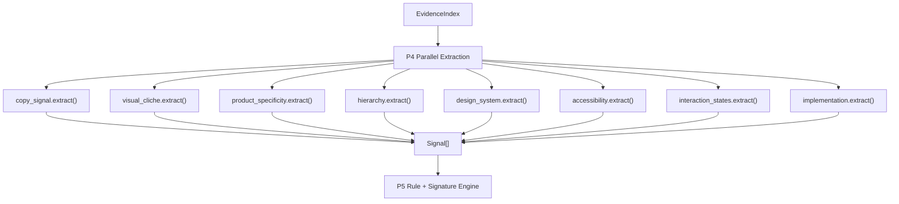

Signal은 아직 최종 finding이 아니다.
Signal은 “관찰된 증거”이고, Rule은 “그 증거가 제품 readiness를 얼마나 해치는지”를 판단한다.

```ts
type Signal = {
  id: string;
  family:
    | "copy_signal"
    | "visual_cliche"
    | "product_specificity"
    | "hierarchy"
    | "system_fit"
    | "accessibility"
    | "interaction_readiness"
    | "implementation";

  confidence: number;
  evidence: Evidence[];
  source?: SourceLocation;
};
```

---

### P5 · Rule & Signature Engine

UNSLOP의 rule engine은 단일 룰보다 **cluster signature**를 중요하게 봐야 한다.

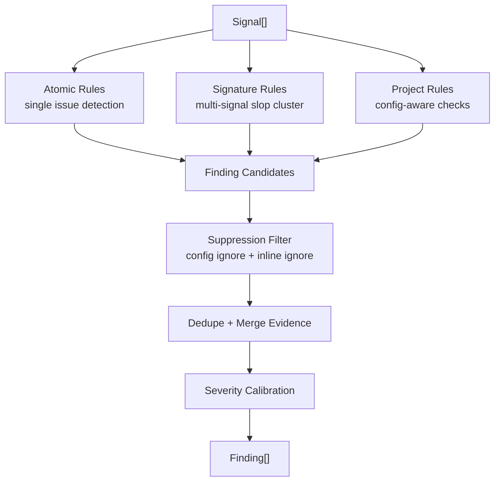

Atomic rule 예시:

```ts
const genericCtaRule = {
  id: "generic-cta-get-started",
  family: "copy_signal",
  detect(ctx: RuleContext): Finding[] {
    return ctx.evidence.text.ctas
      .filter((cta) => /^(get started|learn more|start now)$/i.test(cta.text))
      .map((cta) => ({
        rule_id: "generic-cta-get-started",
        category: "copy_signal",
        severity: "medium",
        confidence: 0.82,
        message: "Generic CTA copy",
        reason:
          "The CTA does not describe what happens next or tie to a configured user task.",
        evidence: cta.text,
        source: cta.source,
        suggested_fix:
          "Replace the CTA with a concrete next action from product.primary_tasks.",
        fix_bucket: "safe",
      }));
  },
};
```

Signature rule 예시:

```ts
const genericAiSaasHeroCluster = {
  id: "generic-ai-saas-hero-cluster",
  family: "slop_signature",
  detect(ctx: RuleContext): Finding[] {
    const hasPurpleCyanGradient = ctx.hasSignal("visual.gradient.purple_cyan");
    const hasGlowOrOrb = ctx.hasAnySignal([
      "visual.decorative_orb",
      "visual.blur_glow",
    ]);
    const hasGlassCard = ctx.hasSignal("visual.glass_card");
    const hasGenericAiCopy = ctx.hasAnySignal([
      "copy.ai_powered_insights",
      "copy.unlock_potential",
    ]);
    const hasGenericCta = ctx.hasSignal("copy.generic_cta");
    const lacksDomainObject = ctx.hasSignal("product.domain_object_absence");

    const score = [
      hasPurpleCyanGradient,
      hasGlowOrOrb,
      hasGlassCard,
      hasGenericAiCopy,
      hasGenericCta,
      lacksDomainObject,
    ].filter(Boolean).length;

    if (score < 4) return [];

    return [
      {
        rule_id: "generic-ai-saas-hero-cluster",
        category: "product_specificity",
        severity: score >= 5 ? "high" : "medium",
        confidence: Math.min(0.95, 0.55 + score * 0.08),
        message: "Generic AI SaaS hero cluster",
        reason:
          "The hero combines common AI SaaS visual patterns with generic copy, but does not expose a product-specific user task.",
        evidence: ctx.collectEvidence([
          "visual.gradient.purple_cyan",
          "visual.decorative_orb",
          "visual.glass_card",
          "copy.ai_powered_insights",
          "copy.generic_cta",
          "product.domain_object_absence",
        ]),
        suggested_fix:
          "Replace the generic hero claim and CTA with a task-specific product action, then remove decorative visuals that do not support that action.",
        fix_bucket: "suggested",
      },
    ];
  },
};
```

---

### P6 · Score & Quality Gate

UNSLOP의 decision은 단순 점수가 아니라 **release decision**이어야 한다.

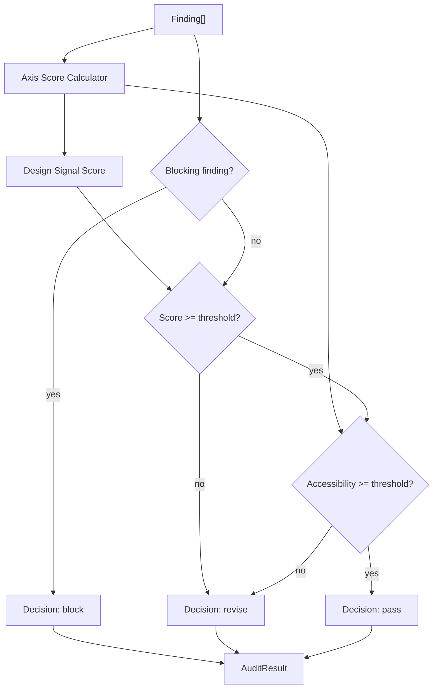

Score axis:

```ts
type ScoreAxis =
  | "accessibility"
  | "system_fit"
  | "copy_signal"
  | "product_specificity"
  | "hierarchy"
  | "interaction_readiness"
  | "visual_intent";

type DesignSignalScore = {
  total: number;
  decision: "pass" | "revise" | "block";
  axes: Record<ScoreAxis, number>;
  thresholds: {
    design_signal: number;
    accessibility: number;
  };
};
```

권장 기본 가중치:

```yaml
score_weights:
  accessibility: 25
  system_fit: 20
  copy_signal: 20
  product_specificity: 15
  hierarchy: 10
  interaction_readiness: 5
  visual_intent: 5
```

---

### P7 · Fix Plan / Dispatch

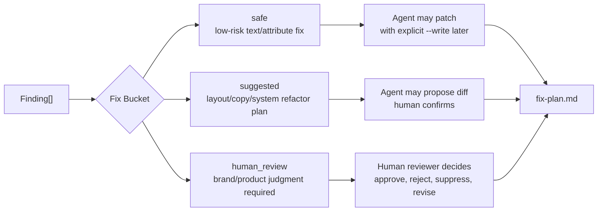

Fix plan markdown 형식:

```md
# UNSLOP Fix Plan

## Decision

revise

## Priority 1 — Product Intent Recovery

- [HIGH] generic-ai-saas-hero-cluster
  - Evidence: `Unlock your potential with AI-powered insights`
  - Why: Hero does not expose a product-specific user task.
  - Fix: Replace headline with a configured task.
  - Bucket: suggested

## Priority 2 — Task-Specific CTA

- [MEDIUM] generic-cta-get-started
  - Evidence: `Get Started`
  - Fix: Use `Review 5 wrong answers`.
  - Bucket: safe

## Priority 3 — State Coverage

- [MEDIUM] missing-empty-error-state
  - Evidence: list/table exists, but no empty/error state found.
  - Fix: Add empty and error components.
  - Bucket: suggested

## Human Review

- Decorative visual direction
- Brand-level illustration style
```

---

### P8 · Persist / Report / Exit

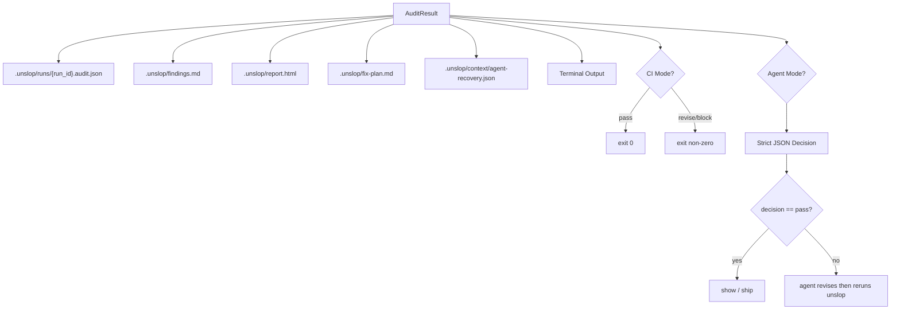

AuditResult schema 초안:

```ts
type AuditResult = {
  schema_version: "0.1.0";
  run_id: string;

  mode: "check" | "agent-check" | "plan" | "report";

  target: {
    kind: "url" | "files" | "stdin";
    label: string;
    adapter: "playwright" | "fetch" | "source" | "stdin";
  };

  decision: "pass" | "revise" | "block";

  scores: {
    design_signal: number;
    axes: Record<string, number>;
  };

  findings: Finding[];

  safe_fixes: FixCandidate[];
  suggested_fixes: FixCandidate[];
  human_review_required: Finding[];

  artifacts: {
    audit_json?: string;
    findings_md?: string;
    fix_plan_md?: string;
    html_report?: string;
    dom_snapshot?: string;
    style_snapshot?: string;
    agent_recovery?: string;
  };

  next_action:
    | "ship"
    | "revise"
    | "human_review"
    | "rerun_with_playwright"
    | "add_product_contract";
};
```

---

## 5. Agent Feedback Loop

UNSLOP은 AI agent가 만든 UI를 사용자가 보기 전에 막는 preflight layer가 되어야 한다.

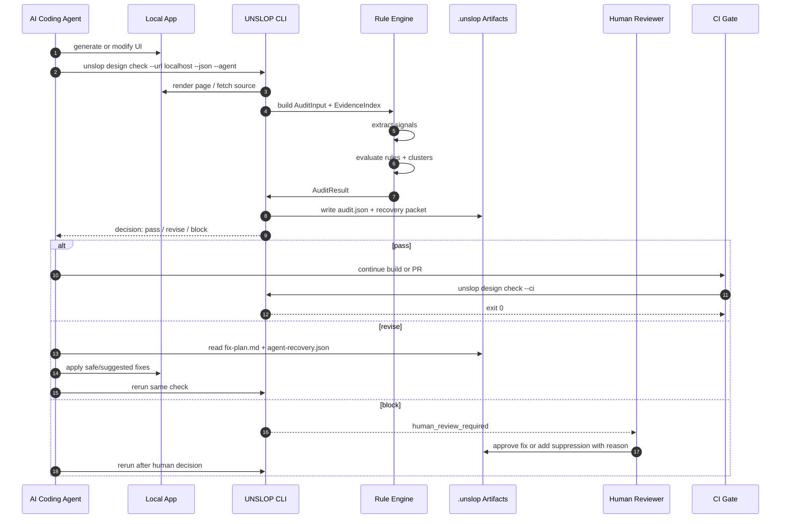

---

## 6. Context Compaction & Recovery

참조 이미지의 오른쪽 “Context Compaction & Recovery”는 UNSLOP에서도 중요하다. Agent가 여러 번 UI를 수정하면 대화 컨텍스트는 압축되거나 유실된다. 그래서 UNSLOP은 매번 **복구 가능한 최소 문맥**을 파일로 남겨야 한다.

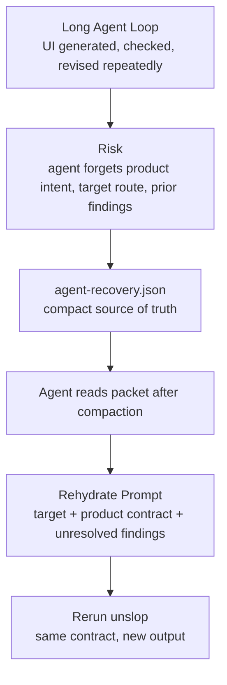

`agent-recovery.json` 예시:

```json
{
  "schema_version": "0.1.0",
  "run_id": "2026-06-07T04-23-45Z",
  "target": {
    "kind": "url",
    "label": "http://localhost:3000"
  },
  "decision": "revise",
  "scores": {
    "design_signal": 62,
    "axes": {
      "copy_signal": 45,
      "product_specificity": 40,
      "accessibility": 88,
      "system_fit": 70,
      "hierarchy": 58,
      "interaction_readiness": 50,
      "visual_intent": 42
    }
  },
  "product_contract": {
    "name": "DOTORE TOPIK",
    "primary_user": "TOPIK learners",
    "primary_tasks": [
      "solve TOPIK questions",
      "review wrong answers",
      "track vocabulary mistakes"
    ],
    "domain_objects": [
      "question",
      "wrong answer",
      "vocabulary",
      "mock test",
      "score report"
    ]
  },
  "unresolved_findings": [
    {
      "rule_id": "generic-ai-saas-hero-cluster",
      "severity": "high",
      "fix_bucket": "suggested",
      "message": "Generic AI SaaS hero cluster",
      "required_change": "Replace generic hero copy with a product-specific task."
    },
    {
      "rule_id": "generic-cta-get-started",
      "severity": "medium",
      "fix_bucket": "safe",
      "message": "Generic CTA copy",
      "required_change": "Replace CTA with a concrete next action."
    }
  ],
  "safe_fixes": [
    {
      "target": "src/app/page.tsx",
      "before": "Get Started",
      "after_suggestion": "Review 5 wrong answers"
    }
  ],
  "human_review_required": [],
  "rerun_command": "unslop design check --url http://localhost:3000 --json --agent"
}
```

---

## 7. Rule Families

README의 MVP rule 방향과 맞춰, rule family는 다음처럼 유지한다. 현재 README도 MVP rules로 generic AI SaaS visual language, card soup, generic copy, design-system drift, accessibility basics, missing interaction states를 명시하고 있습니다. ([GitHub][1])

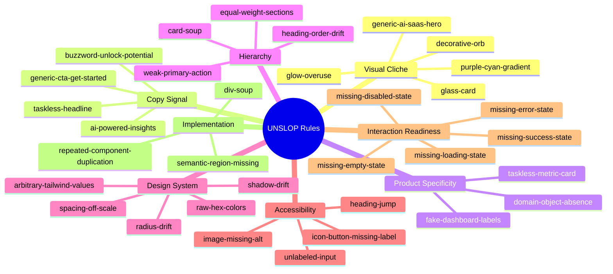

---

## 8. Finding Object

Finding은 “경고 문장”이 아니라 사람과 agent가 함께 읽는 작업 단위다.

```ts
type Finding = {
  id: string;
  rule_id: string;

  category:
    | "visual_intent"
    | "copy_signal"
    | "product_specificity"
    | "hierarchy"
    | "system_fit"
    | "accessibility"
    | "interaction_readiness"
    | "implementation";

  severity: "low" | "medium" | "high" | "blocking";
  confidence: number;

  message: string;
  reason: string;

  evidence: Evidence[];

  source?: {
    file?: string;
    line?: number;
    column?: number;
    selector?: string;
    text?: string;
  };

  suggested_fix: string;

  fix_bucket: "safe" | "suggested" | "human_review";

  suppression?: {
    suppressible: boolean;
    inline_hint?: string;
    config_hint?: string;
  };
};
```

좋은 finding 예시:

```json
{
  "id": "finding_001",
  "rule_id": "generic-ai-saas-hero-cluster",
  "category": "product_specificity",
  "severity": "high",
  "confidence": 0.91,
  "message": "Generic AI SaaS hero cluster",
  "reason": "The hero combines a purple/cyan gradient, decorative glow, generic AI claim, and taskless CTA, but does not expose a configured product task.",
  "evidence": [
    {
      "kind": "class",
      "value": "bg-gradient-to-br from-purple-600 to-cyan-400"
    },
    {
      "kind": "text",
      "value": "Unlock your potential with AI-powered insights"
    },
    {
      "kind": "cta",
      "value": "Get Started"
    }
  ],
  "source": {
    "file": "src/app/page.tsx",
    "line": 12
  },
  "suggested_fix": "Replace the hero with a product-specific task such as 'Review the TOPIK questions you missed this week' and use a concrete CTA such as 'Review 5 wrong answers'.",
  "fix_bucket": "suggested"
}
```

---

## 9. Decision State Machine

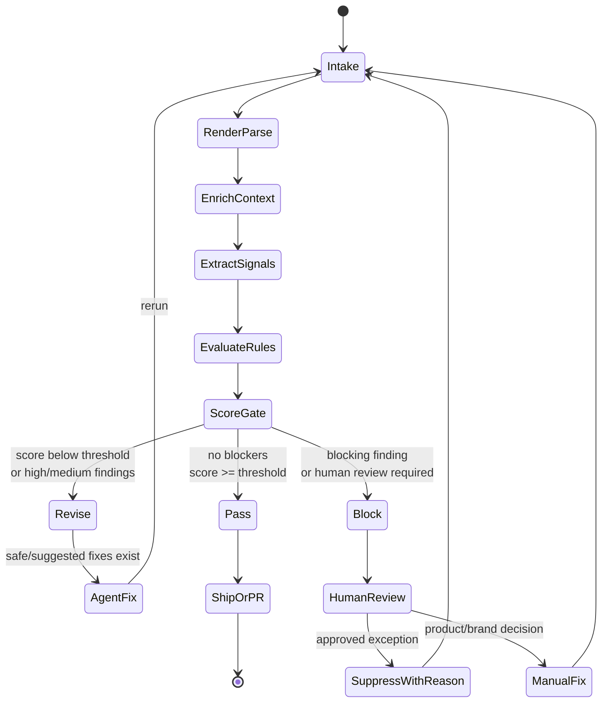

---

## 10. 파일 시스템 레이아웃

참조 이미지의 왼쪽 “Disk Persistent Artifacts”를 UNSLOP에서는 이렇게 잡는다.

```txt
project-root/
  unslop.design.yml

  .unslop/
    profile.json
    context/
      agent-recovery.json
      last-check.md
    runs/
      2026-06-07T04-23-45Z.audit.json
      2026-06-07T04-23-45Z.agent.json
    snapshots/
      2026-06-07T04-23-45Z.dom.html
      2026-06-07T04-23-45Z.styles.json
      2026-06-07T04-23-45Z.a11y.json
    reports/
      2026-06-07T04-23-45Z.report.html
    plans/
      2026-06-07T04-23-45Z.fix-plan.md
    findings/
      2026-06-07T04-23-45Z.findings.md

  examples/
    fixtures/
      slop/
        generic-ai-saas-hero.tsx
        card-soup-dashboard.tsx
      pass/
        product-specific-topik-dashboard.tsx
```

---

## 11. CLI Surface와 레이어 매핑

현재 README에는 `design check`, `design plan`, `design fix`, `design report`, `design agent-check` 흐름이 제시되어 있고, CI mode와 agent mode도 명시되어 있습니다. ([GitHub][1])

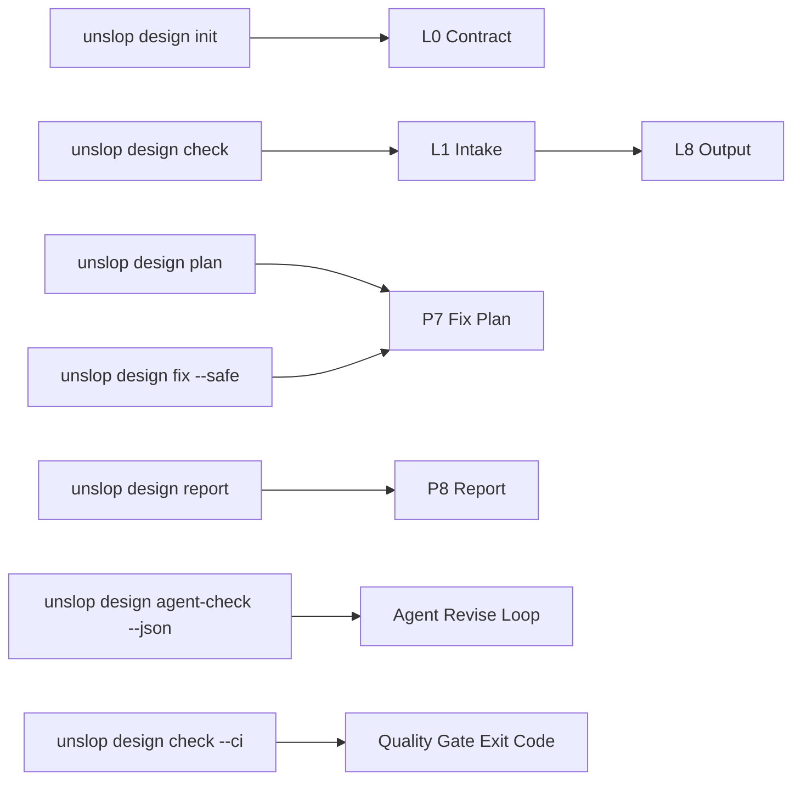

권장 명령:

```bash
# local URL
unslop design check --url http://localhost:3000

# source files
unslop design check "src/**/*.tsx"

# strict JSON for agents
unslop design check --url http://localhost:3000 --json --agent

# CI gate
unslop design check --url http://localhost:3000 --threshold 75 --accessibility-threshold 85 --ci

# review handoff
unslop design report --url http://localhost:3000 -o .unslop/reports/latest.html

# grouped fix plan
unslop design plan --url http://localhost:3000 --product "TOPIK learning app"
```

---

## 12. MVP에서 반드시 보여줘야 하는 흐름

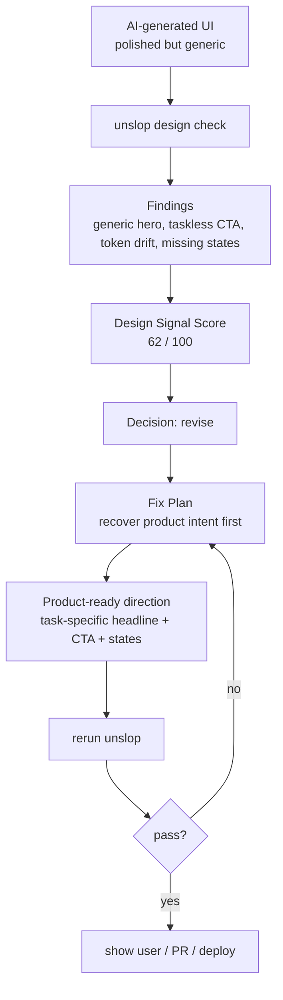

Before:

```tsx
<main className="bg-gradient-to-br from-purple-600 to-cyan-400">
  <div className="absolute rounded-full blur-3xl" />
  <h1>Unlock your potential with AI-powered insights</h1>
  <button>Get Started</button>
</main>
```

After direction:

```tsx
<main className="bg-surface text-foreground">
  <h1>Review the TOPIK questions you missed this week</h1>
  <button>Review 5 wrong answers</button>
</main>
```

이 데모의 메시지는 “예쁜 효과를 제거했다”가 아니다.

```txt
generic polish를 제거했다.
taskless copy를 사용자 과업으로 바꿨다.
장식 중심 화면을 제품 플로우로 되돌렸다.
```

---

## 13. 참조 이미지와 1:1 대응되는 구조

| 참조 이미지 요소               | UNSLOP 대응                                                                             |
| ----------------------- | ------------------------------------------------------------------------------------- |
| Context Artifacts       | `unslop.design.yml`, `.unslop/runs`, `.unslop/snapshots`, `.unslop/reports`, fixtures |
| Manager-Orchestrator    | `unslop design check` runtime orchestrator                                            |
| Hooks                   | config validation, adapter fallback, suppression, threshold gate, CI exit             |
| Skills                  | browser adapter, source parser, extractors, rules, scorers, reporters                 |
| Specialist Agent        | frontend agent, copy agent, design-system agent, human reviewer                       |
| P1~P8 Phases            | Init, Intake, Render/Parse, Enrich, Extract, Evaluate, Gate, Report                   |
| Parallel Implementation | parallel signal extractors                                                            |
| QA Feedback Loop        | agent revise loop + human review + rerun                                              |
| Context Compaction      | `agent-recovery.json`                                                                 |
| Dispatch back to P4     | revise 후 같은 target으로 재검사                                                              |

---

## 최종 방향

UNSLOP의 레이어는 이렇게 정의하면 명확합니다.

```txt
UNSLOP = Product Intent Contract
       + Rendered/Source Evidence
       + Parallel Design Signals
       + Deterministic Rule Clusters
       + Product Readiness Score
       + Agent/Human Fix Loop
       + Persistent Recovery Artifacts
```

이 구조로 가면 “AI SLOP 느낌을 없앤다”가 아니라,

> AI가 만든 그럴듯한 화면에서
> 제품 의도, 사용자 과업, 도메인 객체, 상태, 접근성, 디자인 시스템 근거가 비어 있는 지점을 찾아
> 사람과 agent가 반복 수정할 수 있는 품질 게이트로 만든다.

가 된다.

이 문서는 `docs/architecture/unslop-layers.md` 기준 문서로 사용한다. README에는 첫 번째 Mermaid를 축약한 compact diagram을 두고, docs에는 full diagram과 phase별 상세 설계를 유지한다.

[1]: https://github.com/sunseol/unslop "GitHub - sunseol/unslop: CLI-first design quality gate for AI-generated interfaces. · GitHub"
