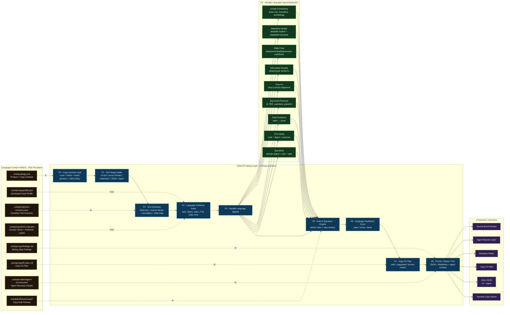
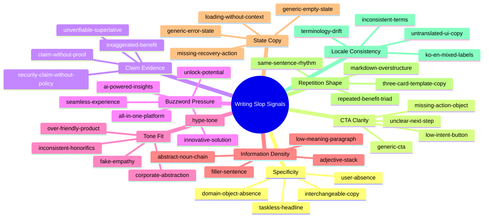
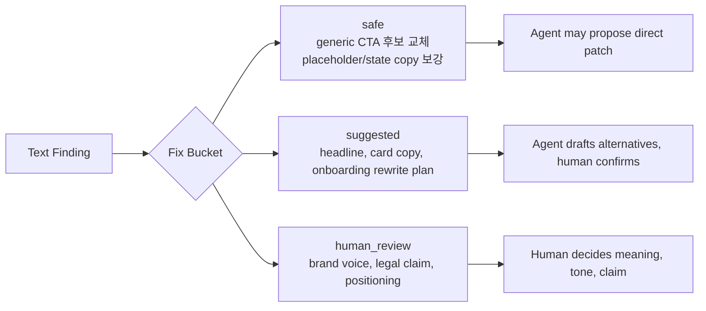
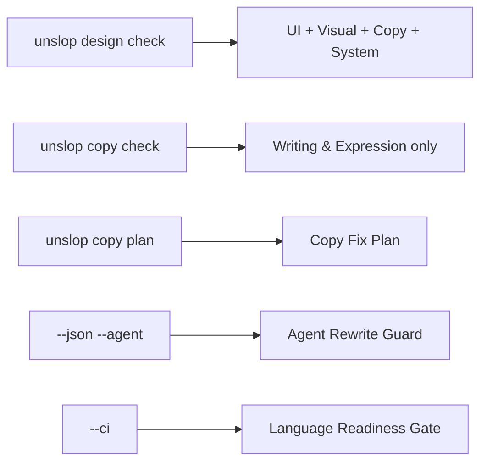

# UNSLOP Writing & Expression Slop Layer

> 문서 위치 제안: `docs/architecture/unslop-writing-style-layer.md`
>
> 목적: 기존 `unslop-layers.md`가 UI/시각/구현 품질 레이어를 설명한다면, 이 문서는 **문체, 표현, 카피, 안내문, 에이전트 응답, 문서 문장**에서 발생하는 AI slop을 어떻게 탐지하고 줄일지 정의한다.

---

## 0. 핵심 결론

UNSLOP은 글을 “사람이 쓴 것처럼” 바꾸는 도구가 아니다.

UNSLOP의 Writing & Expression Layer는 다음 질문에 답한다.

> 이 문장은 실제 제품의 사용자, 과업, 상황, 증거, 다음 행동을 충분히 드러내는가?

따라서 이 레이어의 목표는 **AI 문체 감지**가 아니라 **언어적 제품 의도 복원**이다.

```txt
AI writing slop = fluent but product-indifferent language

겉으로는 자연스럽고 매끄럽지만,
누구에게 하는 말인지,
무슨 문제를 해결하는지,
어떤 증거가 있는지,
사용자가 다음에 무엇을 해야 하는지 드러나지 않는 문장.
```

가장 짧은 원칙은 다음이다.

```txt
Do not humanize text.
Recover product intent.
```

한국어로는 다음과 같이 정의한다.

```txt
문체 slop 제거는 AI 티를 감추는 작업이 아니다.
빈말, 과장, 범용 표현, 근거 없는 주장, 과업 없는 CTA를
제품 맥락이 있는 문장으로 되돌리는 작업이다.
```

---

## 1. 왜 별도 레이어가 필요한가

기존 UNSLOP의 핵심 방향은 “AI가 만든 그럴듯한 화면에서 제품 의도, 사용자 과업, 도메인 객체, 상태, 접근성, 디자인 시스템 근거가 비어 있는 지점을 찾는 품질 게이트”다.

하지만 UI slop의 절반은 화면 장식이 아니라 **문장**에서 발생한다.

```tsx
<h1>Unlock your potential with AI-powered insights</h1>
<p>Experience the future of productivity with our powerful platform.</p>
<button>Get Started</button>
```

이 화면의 문제는 단순히 `gradient`, `orb`, `glass card`가 아니다.

진짜 문제는 다음이다.

```txt
누구의 잠재력인가?
무슨 일을 하는 제품인가?
AI-powered insights가 어떤 결과를 주는가?
사용자가 버튼을 누르면 무엇이 시작되는가?
이 문장을 다른 SaaS에 붙여도 그대로 말이 되는가?
```

따라서 UNSLOP은 visual/copy를 분리해서 보되, 최종 판단은 하나로 묶어야 한다.

```txt
Visual slop: 제품 의미 없는 장식
Copy slop: 제품 과업 없는 문장
Combined slop: 장식 + 빈말 + generic CTA + 도메인 객체 부재
```

---

## 2. 정의: Writing Slop

### 2.1 Writing Slop의 정의

```txt
Writing Slop = 특정 제품의 사용자와 상황을 설명하지 못하는 고유성 낮은 문장 패턴
```

더 엄밀하게는 다음 조건을 만족하는 문장이다.

1. **교체 가능성**: 제품명만 바꾸면 거의 모든 SaaS에 붙일 수 있다.
2. **과업 부재**: 사용자가 실제로 할 일을 말하지 않는다.
3. **도메인 객체 부재**: 제품이 다루는 객체가 없다.
4. **근거 없는 주장**: 빠르다, 강력하다, 안전하다, 혁신적이다 같은 말을 증거 없이 한다.
5. **행동 불명확성**: CTA가 다음 결과를 설명하지 않는다.
6. **상태 맥락 부재**: empty/error/loading/success 문구가 사용자의 상황을 돕지 않는다.
7. **톤 불일치**: 제품 성격과 맞지 않는 과장, 친근함, 격식, 감탄을 사용한다.

### 2.2 Writing Slop이 아닌 것

다음은 UNSLOP의 목표가 아니다.

```txt
- AI가 썼는지 맞히기
- 문장을 무조건 더 감성적으로 만들기
- 모든 문장을 짧게 줄이기
- 모든 문장을 브랜드 카피처럼 만들기
- 문법 교정기 만들기
- SEO rewrite 도구 만들기
- humanizer 만들기
- 취향에 따라 문체 평가하기
```

UNSLOP은 다음을 검사한다.

```txt
- 이 문장이 제품 맥락을 갖는가?
- 이 문장이 사용자 과업을 돕는가?
- 이 문장이 다음 행동을 분명히 하는가?
- 이 문장의 주장을 뒷받침할 증거가 있는가?
- 이 문장이 같은 화면의 상태, 데이터, 도메인 객체와 연결되는가?
```

---

## 3. 전체 구조



---

## 4. Copy Contract

문체 slop을 줄이려면 “좋은 문장”을 추상적으로 정의하면 안 된다.

프로젝트별로 다음을 명시해야 한다.

```txt
누구에게 말하는가?
어떤 일을 하게 하는가?
어떤 도메인 단어를 쓰는가?
어떤 단어는 피해야 하는가?
어떤 주장에는 증거가 필요한가?
어떤 톤을 유지하는가?
어떤 CTA 형식을 허용하는가?
```

이를 `unslop.design.yml` 안의 `copy` 섹션으로 확장한다.

```yaml
product:
  name: "DOTORE TOPIK"
  type: "education"
  primary_user: "TOPIK learners"
  primary_tasks:
    - solve TOPIK questions
    - review wrong answers
    - track vocabulary mistakes

domain:
  objects:
    - question
    - wrong answer
    - vocabulary
    - grammar pattern
    - mock test
    - score report

copy:
  primary_locale: "ko"
  supported_locales: ["ko", "en"]

  voice:
    description: "calm, concrete, study-focused"
    avoid_tone:
      - hype
      - fake empathy
      - corporate abstraction
      - exaggerated AI promise
    prefer_tone:
      - direct
      - specific
      - practical
      - learner-centered

  preferred_terms:
    learner: "학습자"
    wrong_answer: "오답"
    mock_test: "모의고사"
    vocabulary: "어휘"
    grammar_pattern: "문법 유형"

  avoid_terms:
    - "혁신적인"
    - "차원이 다른"
    - "강력한 AI"
    - "사용자 경험을 향상"
    - "생산성을 극대화"
    - "Unlock your potential"
    - "AI-powered insights"
    - "seamless experience"
    - "all-in-one platform"

  cta:
    require_task_object: true
    generic_blocklist:
      - "Get Started"
      - "Learn More"
      - "Start Now"
      - "시작하기"
      - "자세히 보기"
      - "더 알아보기"
    preferred_patterns:
      - "{verb} {count?} {domain_object}"
      - "{workflow_action} 계속하기"
      - "{state_specific_action}"

  claims:
    require_evidence_for:
      - "fastest"
      - "secure"
      - "enterprise-grade"
      - "best"
      - "혁신적인"
      - "가장 빠른"
      - "안전한"
      - "최고의"
    allowed_evidence_types:
      - metric
      - feature
      - workflow
      - user outcome
      - policy reference

  state_copy:
    required_states:
      - loading
      - empty
      - error
      - disabled
      - success
    error_copy_must_include:
      - cause_or_context
      - recovery_action
    empty_copy_must_include:
      - current_state
      - first_action

  style_limits:
    max_headline_words_ko: 14
    max_headline_words_en: 12
    max_adjectives_per_sentence: 1
    max_buzzwords_per_surface: 1
    discourage_exclamation: true
```

---

## 5. Language Evidence Index

Text extraction 이후에는 모든 문장을 단순 문자열로 보지 않는다.

문장의 위치, 역할, 화면 중요도, 도메인 연결성을 함께 저장해야 한다.

```ts
type LanguageEvidenceIndex = {
  product: {
    name?: string;
    primaryUser?: string;
    primaryTasks: string[];
    domainObjects: string[];
  };

  inventory: TextEvidence[];

  surfaces: {
    hero: TextEvidence[];
    nav: TextEvidence[];
    ctas: TextEvidence[];
    cards: TextEvidence[];
    forms: TextEvidence[];
    emptyStates: TextEvidence[];
    errorStates: TextEvidence[];
    loadingStates: TextEvidence[];
    successStates: TextEvidence[];
    docs: TextEvidence[];
    agentMessages: TextEvidence[];
  };

  taskGrounding: {
    matchedTasks: TaskMatch[];
    unmatchedCtas: TextEvidence[];
    tasklessHeadlines: TextEvidence[];
  };

  domainGrounding: {
    matchedObjects: DomainObjectMatch[];
    missingExpectedObjects: string[];
    genericObjects: TextEvidence[];
  };

  claimEvidence: {
    claims: ClaimEvidence[];
    claimsWithoutProof: ClaimEvidence[];
    riskyClaims: ClaimEvidence[];
  };

  styleSignals: {
    buzzwords: TextEvidence[];
    adjectiveStacks: TextEvidence[];
    repeatedPatterns: RepetitionEvidence[];
    passiveOrAbstractPhrases: TextEvidence[];
    localeMixing: TextEvidence[];
  };
};
```

`TextEvidence`는 반드시 source를 가져야 한다.

```ts
type TextEvidence = {
  id: string;
  text: string;
  locale?: "ko" | "en" | "mixed" | "unknown";
  role:
    | "headline"
    | "subhead"
    | "cta"
    | "nav"
    | "label"
    | "placeholder"
    | "empty_state"
    | "error_state"
    | "loading_state"
    | "success_state"
    | "body"
    | "docs"
    | "agent_message";
  surface: "hero" | "card" | "modal" | "form" | "table" | "page" | "docs" | "unknown";
  importance: "primary" | "secondary" | "supporting";
  source?: {
    file?: string;
    line?: number;
    column?: number;
    selector?: string;
    attribute?: "text" | "aria-label" | "alt" | "placeholder" | "title";
  };
};
```

---

## 6. Writing Slop Signal Families



---

## 7. 핵심 검사 원리

### 7.1 Swap Test

가장 강력한 휴리스틱은 Swap Test다.

```txt
제품명만 바꿔도 문장이 그대로 작동하면 slop risk가 높다.
```

예시:

```txt
Bad:
혁신적인 AI 솔루션으로 생산성을 극대화하세요.

Swap 가능:
회계 SaaS, CRM, 헬스케어 앱, 교육 앱, 채팅봇 모두에 붙일 수 있다.
```

개선 방향:

```txt
Good:
이번 주 틀린 TOPIK 문항 12개를 문법 유형별로 다시 풉니다.

Swap 어려움:
TOPIK, 오답, 문항, 문법 유형이라는 제품 도메인이 들어 있다.
```

Rule 초안:

```ts
const interchangeableCopyRule = {
  id: "interchangeable-copy",
  family: "specificity",
  detect(ctx: CopyRuleContext): TextFinding[] {
    return ctx.textInventory
      .filter((node) => node.importance === "primary")
      .filter((node) => ctx.genericPhraseRatio(node.text) > 0.45)
      .filter((node) => ctx.domainObjectCount(node.text) === 0)
      .filter((node) => ctx.taskVerbCount(node.text) === 0)
      .map((node) => ({
        rule_id: "interchangeable-copy",
        category: "copy_signal",
        severity: "high",
        confidence: 0.86,
        message: "Interchangeable product copy",
        reason:
          "This text could be reused across many products because it does not include a configured user task, domain object, or concrete outcome.",
        evidence: [{ kind: "text", value: node.text }],
        source: node.source,
        suggested_fix:
          "Rewrite the sentence around a specific user task and at least one configured domain object.",
        fix_bucket: "suggested",
      }));
  },
};
```

---

### 7.2 Task Grounding Test

문장이 제품 과업과 연결되는지 검사한다.

```txt
Bad:
Start your journey today.

Good:
오늘의 오답 5개를 다시 풀고 취약 문법을 확인하세요.
```

판정 기준:

```txt
좋은 CTA = 동사 + 도메인 객체 + 기대 결과
```

예시:

| Copy | 판정 | 이유 |
|---|---:|---|
| Get Started | high risk | 행동 결과가 없음 |
| 시작하기 | high risk | 무엇을 시작하는지 없음 |
| Learn More | medium risk | 탐색 행동이지만 제품 과업이 아님 |
| Review 5 wrong answers | good | 동사 + 수량 + 도메인 객체 |
| 이번 모의고사 점수 분석하기 | good | 특정 업무와 결과가 있음 |

Rule 초안:

```ts
const tasklessCtaRule = {
  id: "taskless-cta",
  family: "cta_clarity",
  detect(ctx: CopyRuleContext): TextFinding[] {
    return ctx.ctas
      .filter((cta) => ctx.isGenericCta(cta.text) || !ctx.hasDomainObject(cta.text))
      .map((cta) => ({
        rule_id: "taskless-cta",
        category: "copy_signal",
        severity: ctx.isPrimaryCta(cta) ? "high" : "medium",
        confidence: 0.88,
        message: "Taskless CTA",
        reason:
          "The CTA does not tell the user what action will happen next or which product object it affects.",
        evidence: [{ kind: "cta", value: cta.text }],
        source: cta.source,
        suggested_fix:
          "Use a concrete action tied to product.primary_tasks, such as 'Review 5 wrong answers'.",
        fix_bucket: "safe",
      }));
  },
};
```

---

### 7.3 Claim-Evidence Ratio

AI 문체는 주장과 증거의 비율이 자주 무너진다.

```txt
Bad:
가장 빠르고 안전한 AI 학습 플랫폼입니다.

문제:
- 가장 빠른: 비교 기준 없음
- 안전한: 보안 근거 없음
- AI 학습 플랫폼: 무엇을 학습하는지 없음
```

개선 방향:

```txt
Good:
풀이 기록은 기기 안에 저장되며, 오답 통계는 문법 유형별로 계산됩니다.
```

판정 기준:

```txt
고위험 주장어 + 증거 슬롯 없음 = claim-without-proof
```

증거 슬롯:

```txt
- 숫자: 12개, 3분, 95%
- 대상: 오답, 문항, 단어장, 주문, 인보이스
- 기준: 지난 7일, 이번 모의고사, 현재 프로젝트
- 기능: 자동 분류, 로컬 저장, 재시도
- 제약: 현재는 베타, 일부 파일만 지원
- 출처: 설정, 정책, 테스트 결과, 사용자 입력
```

Rule 초안:

```ts
const claimWithoutProofRule = {
  id: "claim-without-proof",
  family: "claim_evidence",
  detect(ctx: CopyRuleContext): TextFinding[] {
    return ctx.claims
      .filter((claim) => ctx.requiresEvidence(claim.text))
      .filter((claim) => !ctx.hasEvidenceSlot(claim.text))
      .map((claim) => ({
        rule_id: "claim-without-proof",
        category: "copy_signal",
        severity: ctx.isRiskyClaim(claim.text) ? "high" : "medium",
        confidence: 0.84,
        message: "Claim without evidence",
        reason:
          "The copy makes a strong product claim but does not provide a metric, feature, policy, workflow, or constraint that supports it.",
        evidence: [{ kind: "text", value: claim.text }],
        source: claim.source,
        suggested_fix:
          "Add a concrete proof point or replace the claim with a factual description of what the product does.",
        fix_bucket: ctx.isRiskyClaim(claim.text) ? "human_review" : "suggested",
      }));
  },
};
```

---

### 7.4 Buzzword Pressure

AI slop 문장은 자주 다음 단어에 기대어 의미를 대체한다.

```txt
English:
- AI-powered
- unlock
- seamless
- effortlessly
- powerful
- innovative
- cutting-edge
- comprehensive
- robust
- all-in-one
- next-generation
- elevate
- transform
- revolutionize

Korean:
- 혁신적인
- 강력한
- 스마트한
- 최적화된
- 획기적인
- 차원이 다른
- 원활한
- 손쉽게
- 모든 것을 한 곳에서
- 생산성을 극대화
- 사용자 경험을 향상
- 비즈니스를 성장시키세요
- 더 나은 미래
- AI 기반 인사이트
```

중요한 점은 buzzword 하나가 무조건 나쁜 것은 아니라는 점이다.

UNSLOP은 단어 하나가 아니라 **압력**을 본다.

```txt
Buzzword Pressure = buzzword 수 + primary surface 여부 + domain object 부재 + claim evidence 부재
```

Signature rule:

```ts
const buzzwordPressureCluster = {
  id: "buzzword-pressure-cluster",
  family: "copy_signature",
  detect(ctx: CopyRuleContext): TextFinding[] {
    const surfaces = ctx.primarySurfaces();

    return surfaces.flatMap((surface) => {
      const buzzwords = ctx.findBuzzwords(surface.texts);
      const hasDomainObject = ctx.surfaceHasDomainObject(surface);
      const hasTask = ctx.surfaceHasTask(surface);
      const hasProof = ctx.surfaceHasEvidenceSlot(surface);

      const score =
        buzzwords.length +
        (hasDomainObject ? 0 : 2) +
        (hasTask ? 0 : 2) +
        (hasProof ? 0 : 1);

      if (score < 4) return [];

      return [{
        rule_id: "buzzword-pressure-cluster",
        category: "copy_signal",
        severity: score >= 6 ? "high" : "medium",
        confidence: Math.min(0.94, 0.55 + score * 0.06),
        message: "Buzzword-heavy product copy",
        reason:
          "The primary copy relies on generic benefit language instead of naming the product task, object, or proof point.",
        evidence: buzzwords.map((w) => ({ kind: "text", value: w.text })),
        source: surface.source,
        suggested_fix:
          "Replace abstract benefit language with task-specific copy that includes a user action and domain object.",
        fix_bucket: "suggested",
      }];
    });
  },
};
```

---

### 7.5 State Copy Usefulness

상태 문구는 AI slop이 가장 쉽게 드러나는 곳이다.

```txt
Bad empty:
No data.

Bad error:
Something went wrong.

Bad loading:
Loading...
```

좋은 상태 문구는 사용자의 현재 상황과 다음 행동을 알려준다.

```txt
Good empty:
아직 풀어본 모의고사가 없습니다. 10문항으로 첫 점수를 만들어보세요.

Good error:
단어장을 불러오지 못했습니다. 네트워크를 확인한 뒤 다시 시도하세요.

Good loading:
지난 7일 오답을 문법 유형별로 정리하는 중입니다.
```

검사 기준:

| State | 필요한 정보 |
|---|---|
| loading | 무엇을 처리 중인지 |
| empty | 왜 비어 있는지 + 첫 행동 |
| error | 무엇이 실패했는지 + 복구 행동 |
| disabled | 왜 비활성인지 + 활성 조건 |
| success | 무엇이 완료되었는지 + 다음 행동 |

Rule 초안:

```ts
const genericStateCopyRule = {
  id: "generic-state-copy",
  family: "state_copy",
  detect(ctx: CopyRuleContext): TextFinding[] {
    return ctx.stateTexts
      .filter((state) => ctx.isGenericStateText(state.text))
      .map((state) => ({
        rule_id: "generic-state-copy",
        category: "interaction_readiness",
        severity: "medium",
        confidence: 0.82,
        message: "Generic state copy",
        reason:
          "The state message does not explain the current product state or tell the user how to proceed.",
        evidence: [{ kind: "text", value: state.text }],
        source: state.source,
        suggested_fix:
          "Add the failed or empty product object and a recovery or first action.",
        fix_bucket: "suggested",
      }));
  },
};
```

---

### 7.6 Template Rhythm Detection

AI 문체는 의미뿐 아니라 리듬도 반복된다.

흔한 패턴:

```txt
Discover X. Experience Y. Transform Z.
Fast. Powerful. Secure.
Save time, boost productivity, unlock insights.
Built for teams who want to move faster.
```

한국어 패턴:

```txt
더 빠르게, 더 스마트하게, 더 효율적으로.
A부터 Z까지 한 번에.
복잡한 과정을 간단하게.
지금 바로 새로운 경험을 시작하세요.
```

탐지 기준:

```txt
- 세 개 카드가 모두 같은 문장 구조를 가짐
- 모든 benefit이 추상 명사로 끝남
- 같은 동사/형용사가 반복됨
- 제품 객체 없이 리듬만 있음
- 각 카드 제목이 서로 교체 가능함
```

예시 finding:

```json
{
  "rule_id": "three-card-template-copy",
  "category": "copy_signal",
  "severity": "medium",
  "confidence": 0.79,
  "message": "Template-shaped benefit cards",
  "reason": "The three cards use the same generic benefit structure and do not name distinct product workflows.",
  "evidence": [
    { "kind": "text", "value": "Save time" },
    { "kind": "text", "value": "Boost productivity" },
    { "kind": "text", "value": "Unlock insights" }
  ],
  "suggested_fix": "Rename each card after a real workflow, such as '오답 자동 분류', '문법 유형별 복습', '모의고사 점수 추적'.",
  "fix_bucket": "suggested"
}
```

---

## 8. Rule Families 상세

### 8.1 Specificity Rules

| Rule ID | Severity | 설명 |
|---|---:|---|
| `interchangeable-copy` | high | 제품명만 바꿔도 모든 제품에 붙는 문장 |
| `domain-object-absence-copy` | high | 주요 headline/CTA/card에 도메인 객체 없음 |
| `taskless-headline` | high | headline이 사용자 과업을 말하지 않음 |
| `abstract-benefit-only` | medium | benefit은 있으나 기능/업무/증거 없음 |
| `user-absence` | medium | primary user 맥락 없음 |

### 8.2 CTA Rules

| Rule ID | Severity | 설명 |
|---|---:|---|
| `taskless-cta` | high | CTA가 다음 행동을 말하지 않음 |
| `generic-cta` | medium | Get Started, Learn More, 시작하기 등 |
| `cta-missing-object` | medium | 동사는 있으나 대상 객체 없음 |
| `too-many-primary-ctas` | medium | 모든 버튼이 같은 우선순위 |
| `misleading-cta` | high | 버튼 문구와 실제 결과가 다름 |

### 8.3 Claim Rules

| Rule ID | Severity | 설명 |
|---|---:|---|
| `claim-without-proof` | medium/high | 강한 주장에 근거 없음 |
| `superlative-without-basis` | high | 최고, fastest, best 등 비교 근거 없음 |
| `security-claim-without-policy` | blocking/human | 보안/개인정보 주장에 정책/구현 근거 없음 |
| `ai-claim-without-capability` | high | AI 기능을 말하지만 실제 기능 설명 없음 |
| `metric-without-source` | medium | 숫자가 있으나 기준/출처 없음 |

### 8.4 Tone Rules

| Rule ID | Severity | 설명 |
|---|---:|---|
| `hype-tone` | medium | 제품 성격보다 과장된 톤 |
| `fake-empathy` | medium | 공감 표현은 있으나 문제 해결 없음 |
| `corporate-abstraction` | medium | 기업용 추상 문구 남발 |
| `honorific-inconsistency` | low/medium | 한국어 존대/반말 혼용 |
| `voice-contract-drift` | medium | copy.voice 계약과 어긋남 |

### 8.5 State Copy Rules

| Rule ID | Severity | 설명 |
|---|---:|---|
| `generic-empty-state` | medium | 빈 상태가 이유와 첫 행동을 말하지 않음 |
| `generic-error-state` | high | 오류가 원인/복구를 말하지 않음 |
| `loading-without-context` | low/medium | 로딩 대상이 없음 |
| `disabled-without-reason` | medium | 비활성 이유가 없음 |
| `success-without-next-step` | low/medium | 성공 후 다음 행동 없음 |

### 8.6 Locale & Terminology Rules

| Rule ID | Severity | 설명 |
|---|---:|---|
| `mixed-locale-ui-copy` | medium | 같은 surface에서 ko/en 혼용 |
| `preferred-term-drift` | medium | 설정된 용어 대신 다른 용어 사용 |
| `untranslated-placeholder` | low/medium | placeholder만 다른 언어 |
| `inconsistent-product-naming` | medium | 제품명 표기 흔들림 |
| `domain-term-over-variation` | medium | 같은 객체를 여러 이름으로 부름 |

---

## 9. Signature Clusters

단일 단어 하나로 slop을 판정하면 false positive가 커진다.

UNSLOP은 다음과 같은 조합을 고위험으로 본다.

### 9.1 Universal Benefit Hero Cluster

```txt
generic headline
+ buzzword benefit
+ no domain object
+ generic CTA
+ no proof point
= universal-benefit-hero-cluster
```

예시:

```tsx
<h1>Transform your workflow with AI</h1>
<p>Unlock powerful insights and boost productivity.</p>
<button>Get Started</button>
```

Finding:

```json
{
  "rule_id": "universal-benefit-hero-cluster",
  "category": "copy_signal",
  "severity": "high",
  "confidence": 0.92,
  "message": "Universal benefit hero copy",
  "reason": "The hero could describe almost any AI SaaS product because it does not name a user task, domain object, or proof point.",
  "suggested_fix": "Rewrite the hero around one configured primary task and one domain object."
}
```

### 9.2 AI Capability Fog Cluster

```txt
AI-powered / intelligent / smart
+ no specific model capability
+ no workflow step
+ no user-visible output
= ai-capability-fog
```

Bad:

```txt
AI 기반 인사이트로 학습을 혁신하세요.
```

Good:

```txt
오답을 문법 유형별로 묶고, 이번 주에 다시 풀 문제를 추천합니다.
```

### 9.3 Empty State Dead-End Cluster

```txt
empty state exists
+ generic "No data"
+ no explanation
+ no first action
= empty-state-dead-end
```

Bad:

```txt
No results.
```

Good:

```txt
아직 저장된 오답이 없습니다. 모의고사 10문항을 풀면 첫 오답 노트가 만들어집니다.
```

### 9.4 Corporate Fog Paragraph

```txt
abstract nouns
+ passive structure
+ no actor
+ no object
+ no outcome
= corporate-fog-paragraph
```

Bad:

```txt
효율적인 프로세스 최적화를 통해 사용자 경험 향상을 지원합니다.
```

Good:

```txt
학습자가 틀린 문제를 저장하면, 문법 유형과 어휘 항목별로 오답 노트가 자동 정리됩니다.
```

### 9.5 Over-Structured Agent Prose

Agent나 report 문장에서도 slop이 생긴다.

Bad:

```txt
좋습니다. 이제 다음 단계로 넘어가겠습니다. 아래에 자세히 정리했습니다.
```

문제:

```txt
- 실제 정보가 나오기 전 준비 문장이 길다.
- 작업 결과보다 진행 멘트가 먼저 온다.
- 같은 구조의 bullet이 반복된다.
```

Good:

```txt
`generic-cta`와 `claim-without-proof` 두 finding이 남아 있습니다. 먼저 CTA를 제품 과업으로 바꾸세요.
```

Rule:

```txt
agent response should start with result, finding, or next action.
avoid filler preface.
```

---

## 10. Scoring

기존 Design Signal Score 안의 `copy_signal` 축을 확장하되, 문체 검사를 별도로 실행할 때는 `Language Readiness Score`를 제공한다.

```ts
type LanguageReadinessScore = {
  total: number;
  decision: "pass" | "revise" | "block";
  axes: {
    specificity: number;
    task_clarity: number;
    evidence_density: number;
    tone_fit: number;
    state_copy: number;
    terminology: number;
    information_density: number;
    repetition_risk: number;
  };
};
```

권장 가중치:

```yaml
language_score_weights:
  specificity: 25
  task_clarity: 20
  evidence_density: 15
  tone_fit: 10
  state_copy: 10
  terminology: 10
  information_density: 5
  repetition_risk: 5
```

Decision 기준:

| Decision | 조건 |
|---|---|
| `pass` | 주요 surface의 copy가 제품 과업과 연결되고 blocking claim 없음 |
| `revise` | high/medium copy finding이 남아 있으나 safe/suggested fix 가능 |
| `block` | 보안/개인정보/의료/금융 등 고위험 주장에 근거 없음, 또는 브랜드/법무 검토 필요 |

---

## 11. Fix Bucket 정책

문체 수정은 자동화하기 쉬워 보이지만, 실제로는 제품 의미를 바꿀 수 있다.

따라서 기존 UNSLOP 정책과 동일하게 `safe`, `suggested`, `human_review`로 나눈다.



### 11.1 Safe Fix

다음은 비교적 안전하다.

```txt
- generic CTA를 configured primary task 후보로 교체
- "No data"를 domain object 기반 empty copy 후보로 교체
- "Something went wrong"에 복구 행동 추가
- placeholder의 언어를 primary_locale로 맞춤
- preferred_terms로 용어 통일
```

예시:

```json
{
  "fix_bucket": "safe",
  "before": "Get Started",
  "after_suggestion": "Review 5 wrong answers",
  "reason": "The replacement uses a configured primary task and domain object."
}
```

### 11.2 Suggested Fix

다음은 의미 재구성이 필요하다.

```txt
- hero headline rewrite
- value proposition rewrite
- card title regrouping
- onboarding message rewrite
- report summary rewrite
```

예시:

```json
{
  "fix_bucket": "suggested",
  "before": "AI-powered insights for smarter learning",
  "after_options": [
    "이번 주 오답을 문법 유형별로 다시 풉니다",
    "틀린 TOPIK 문항을 모아 취약 문법부터 복습하세요",
    "모의고사 오답을 어휘·문법·읽기 유형으로 정리합니다"
  ],
  "reason": "Each option names a task and a domain object, but product should choose the final positioning."
}
```

### 11.3 Human Review

다음은 사람 검토가 필요하다.

```txt
- 최고, 가장 빠른, 안전한, 검증된 등 법적/신뢰 리스크가 있는 주장
- 브랜드 톤 결정
- 가격/성과/보안 claim
- 의료, 금융, 교육 성과 보장 문구
- 사용자에게 약속하는 결과를 바꾸는 문장
```

---

## 12. Output Schema

기존 `Finding`을 재사용하되, copy 전용 정보를 확장한다.

```ts
type TextFinding = Finding & {
  text_role:
    | "headline"
    | "subhead"
    | "cta"
    | "nav"
    | "label"
    | "placeholder"
    | "empty_state"
    | "error_state"
    | "loading_state"
    | "success_state"
    | "docs"
    | "agent_message";

  language_axis:
    | "specificity"
    | "task_clarity"
    | "evidence_density"
    | "tone_fit"
    | "state_copy"
    | "terminology"
    | "information_density"
    | "repetition_risk";

  copy_evidence: {
    matched_domain_objects?: string[];
    missing_domain_objects?: string[];
    matched_tasks?: string[];
    buzzwords?: string[];
    claim_terms?: string[];
    evidence_slots?: string[];
    generic_phrase_ratio?: number;
  };

  rewrite_constraints: {
    must_include?: string[];
    must_avoid?: string[];
    max_words?: number;
    locale?: "ko" | "en";
    tone?: string[];
  };
};
```

JSON 예시:

```json
{
  "id": "finding_copy_001",
  "rule_id": "universal-benefit-hero-cluster",
  "category": "copy_signal",
  "language_axis": "specificity",
  "severity": "high",
  "confidence": 0.92,
  "text_role": "headline",
  "message": "Universal benefit hero copy",
  "reason": "The hero headline and subhead use generic AI benefit language but do not name the user's task or the product's domain objects.",
  "evidence": [
    { "kind": "text", "value": "Unlock your potential with AI-powered insights" },
    { "kind": "cta", "value": "Get Started" }
  ],
  "copy_evidence": {
    "matched_domain_objects": [],
    "missing_domain_objects": ["wrong answer", "mock test", "vocabulary"],
    "matched_tasks": [],
    "buzzwords": ["Unlock", "AI-powered insights"],
    "generic_phrase_ratio": 0.71
  },
  "suggested_fix": "Rewrite the hero around one primary task and one domain object, such as 'Review the TOPIK questions you missed this week'.",
  "fix_bucket": "suggested",
  "rewrite_constraints": {
    "must_include": ["wrong answer", "TOPIK"],
    "must_avoid": ["AI-powered", "Unlock", "Get Started"],
    "max_words": 14,
    "locale": "en",
    "tone": ["concrete", "study-focused"]
  }
}
```

---

## 13. CLI Surface

문체 레이어는 기존 명령에 자연스럽게 통합한다.

```bash
# 기존 design check 안에서 copy layer 포함
unslop design check --url http://localhost:3000

# copy만 집중 검사
unslop copy check --url http://localhost:3000
unslop copy check "src/**/*.{tsx,mdx,md,json}"

# agent용 strict JSON
unslop copy check --url http://localhost:3000 --json --agent

# copy fix plan
unslop copy plan --url http://localhost:3000

# 문서/README/랜딩 카피 검사
unslop copy check README.md docs/**/*.md
```

기존 CLI와 매핑:



권장 product message:

```txt
UNSLOP checks whether your interface copy proves product intent.
It does not humanize text. It removes interchangeable, taskless, evidence-free copy.
```

한국어:

```txt
UNSLOP은 문장을 더 사람답게 꾸미지 않는다.
어디에나 붙는 빈말을 사용자 과업, 제품 객체, 근거가 있는 문장으로 바꿀 수 있게 검사한다.
```

---

## 14. Agent Rewrite Guard

AI agent가 copy finding을 수정할 때는 다음 규칙을 강제해야 한다.

```txt
1. 원래 문장의 의미를 임의로 확장하지 않는다.
2. 제품 설정에 없는 기능을 추가하지 않는다.
3. 강한 claim을 새로 만들지 않는다.
4. CTA는 configured primary_tasks 중 하나에 연결한다.
5. 도메인 객체를 최소 하나 포함한다.
6. 상태 문구는 현재 상태와 복구/다음 행동을 포함한다.
7. 대체 문구는 1개만 강제하지 말고 후보를 제공한다.
8. human_review bucket은 자동 rewrite하지 않는다.
```

Agent recovery packet에 copy context를 추가한다.

```json
{
  "copy_contract": {
    "primary_locale": "ko",
    "voice": ["calm", "concrete", "study-focused"],
    "preferred_terms": {
      "wrong_answer": "오답",
      "mock_test": "모의고사"
    },
    "avoid_terms": ["혁신적인", "AI 기반 인사이트", "생산성을 극대화"]
  },
  "copy_findings": [
    {
      "rule_id": "taskless-cta",
      "severity": "high",
      "text": "시작하기",
      "required_change": "CTA must include a product task and object.",
      "safe_candidates": ["오답 5개 다시 풀기", "모의고사 계속 풀기"]
    }
  ],
  "rewrite_guardrails": [
    "Do not introduce unimplemented features.",
    "Do not create security, speed, or outcome claims without evidence.",
    "Use preferred Korean terms from copy_contract.preferred_terms."
  ]
}
```

---

## 15. 예시: Landing Hero

### Before

```tsx
<section>
  <h1>혁신적인 AI로 학습 경험을 향상하세요</h1>
  <p>강력한 인사이트와 원활한 경험으로 더 스마트하게 성장하세요.</p>
  <button>시작하기</button>
</section>
```

### Findings

```txt
[HIGH] universal-benefit-hero-cluster
Evidence:
- "혁신적인 AI"
- "학습 경험을 향상"
- "강력한 인사이트"
- "시작하기"

Why it matters:
이 hero는 교육 제품처럼 보이지만, TOPIK 학습자가 실제로 무엇을 할 수 있는지 말하지 않는다.

Suggested fix:
primary_tasks와 domain.objects를 사용해 headline, subhead, CTA를 재작성한다.
```

### After Direction

```tsx
<section>
  <h1>이번 주 틀린 TOPIK 문항을 문법 유형별로 다시 풉니다</h1>
  <p>오답을 모아 어휘, 문법, 읽기 유형으로 정리하고 다음 복습 순서를 보여줍니다.</p>
  <button>오답 5개 다시 풀기</button>
</section>
```

변경의 핵심:

```txt
혁신적인 AI → TOPIK 문항
학습 경험 향상 → 오답을 문법 유형별로 다시 풀기
강력한 인사이트 → 어휘/문법/읽기 유형 정리
시작하기 → 오답 5개 다시 풀기
```

---

## 16. 예시: Dashboard Cards

### Before

```tsx
<Card title="Powerful Insights" description="Understand your progress at a glance." />
<Card title="Smart Automation" description="Save time with AI-powered workflows." />
<Card title="Seamless Experience" description="Everything you need in one place." />
```

### 문제

```txt
- 세 카드가 서로 다른 기능처럼 보이지만 실제 업무가 없다.
- insight, automation, experience가 무엇을 뜻하는지 불명확하다.
- 제품 도메인 객체가 없다.
```

### After Direction

```tsx
<Card
  title="오답 유형"
  description="최근 7일 오답을 어휘, 문법, 읽기 유형으로 나눠 보여줍니다."
/>
<Card
  title="다시 풀 문제"
  description="가장 많이 틀린 문법 유형에서 5문항을 먼저 추천합니다."
/>
<Card
  title="모의고사 기록"
  description="회차별 점수와 완료 시간을 저장해 다음 복습 기준으로 사용합니다."
/>
```

---

## 17. 예시: Error / Empty / Disabled

### Empty State

Bad:

```txt
No data.
```

Good:

```txt
아직 저장된 오답이 없습니다. 모의고사 10문항을 풀면 첫 오답 노트가 만들어집니다.
```

### Error State

Bad:

```txt
Something went wrong.
```

Good:

```txt
오답 노트를 불러오지 못했습니다. 네트워크를 확인한 뒤 다시 시도하세요.
```

### Disabled State

Bad:

```txt
Disabled
```

Good:

```txt
모의고사를 1회 이상 완료하면 오답 분석을 볼 수 있습니다.
```

### Success State

Bad:

```txt
Done.
```

Good:

```txt
오답 5개를 다시 풀었습니다. 남은 오답 7개를 이어서 복습할 수 있습니다.
```

---

## 18. 예시: README / Docs 문체

UNSLOP은 UI copy뿐 아니라 README와 docs의 AI slop도 잡을 수 있다.

### Bad README Copy

```md
Our platform is a revolutionary solution designed to empower developers with seamless workflows and powerful insights.
```

문제:

```txt
- revolutionary, empower, seamless, powerful가 모두 추상적이다.
- 어떤 개발자가 어떤 작업을 하는지 없다.
- 제품이 검사하는 대상과 결과가 없다.
```

### Better README Copy

```md
UNSLOP is a local-first CLI that checks AI-generated web UI before review.
It scans code, HTML, and localhost pages for generic copy, weak hierarchy, missing states, accessibility issues, and design-system drift.
```

좋은 이유:

```txt
- 대상: AI-generated web UI
- 방식: local-first CLI
- 입력: code, HTML, localhost pages
- 검사 항목: generic copy, weak hierarchy, missing states 등
- 결과: before review
```

---

## 19. Korean-Specific Writing Slop

한국어 AI 문체는 영어와 다른 패턴이 있다.

### 19.1 명사화 과다

Bad:

```txt
효율적인 학습 경험 향상을 위한 맞춤형 솔루션 제공
```

문제:

```txt
누가 무엇을 하는지 동사가 없다.
```

Good:

```txt
틀린 문제를 저장하면 다음 복습 때 같은 문법 유형을 먼저 보여줍니다.
```

### 19.2 과한 수식어

Bad:

```txt
혁신적이고 강력한 AI 기반 맞춤형 학습 플랫폼
```

Good:

```txt
TOPIK 오답을 문법 유형별로 정리하는 학습 도구
```

### 19.3 존대/반말 혼용

Bad:

```txt
오답을 확인하세요. 다음 문제를 풀어봐.
```

Good:

```txt
오답을 확인하고 다음 문제를 풀어보세요.
```

### 19.4 영어 buzzword 혼합

Bad:

```txt
AI-powered 학습 인사이트로 스마트하게 레벨업하세요.
```

Good:

```txt
최근 오답을 기준으로 다음에 풀 문항을 추천합니다.
```

### 19.5 주어 없는 기업 문장

Bad:

```txt
학습 효율 개선을 지원합니다.
```

Good:

```txt
학습자가 자주 틀린 문법 유형을 먼저 복습할 수 있습니다.
```

---

## 20. English-Specific Writing Slop

영어 UI copy에서 특히 많이 나오는 패턴이다.

### 20.1 Unlock / Transform / Elevate

Bad:

```txt
Unlock your team's potential with powerful AI insights.
```

Good:

```txt
Review unresolved support tickets by customer, priority, and last reply time.
```

### 20.2 Seamless / Effortless

Bad:

```txt
A seamless experience for modern teams.
```

Good:

```txt
Import a CSV, map the required columns, and preview invalid rows before upload.
```

### 20.3 Built for everyone

Bad:

```txt
Built for teams of all sizes.
```

Good:

```txt
Built for solo founders reviewing AI-generated landing pages before launch.
```

### 20.4 Vague proof

Bad:

```txt
Trusted by thousands.
```

Good:

```txt
Used in 1,200 local design checks during the beta period.
```

`Trusted by thousands`처럼 검증이 필요한 문장은 근거가 없으면 high 또는 human_review로 보내야 한다.

---

## 21. Report 문체 원칙

UNSLOP 자체가 출력하는 문장도 slop이 없어야 한다.

나쁜 report 문체:

```txt
This design could potentially be improved to create a more seamless and engaging user experience.
```

좋은 report 문체:

```txt
The primary CTA says "Get Started", but the configured task is "review wrong answers". Replace it with a task-specific action.
```

UNSLOP report 원칙:

```txt
1. 첫 문장은 finding이다.
2. 두 번째 문장은 왜 문제인지 product readiness 관점에서 말한다.
3. 세 번째 문장은 evidence다.
4. 네 번째 문장은 다음 행동이다.
5. 미사여구와 가능성 표현을 줄인다.
```

Finding 메시지 포맷:

```txt
[SEVERITY] Rule name

What we found:
<구체적 관찰>

Why it matters:
<사용자 과업 또는 제품 readiness에 미치는 영향>

Evidence:
- <text>
- <source>

Suggested fix:
<다음 행동>

Fix bucket:
<safe | suggested | human_review>
```

나쁜 표현:

```txt
- This could be better.
- Consider improving the copy.
- The tone feels generic.
- Make it more human.
- Enhance user engagement.
```

좋은 표현:

```txt
- The CTA does not describe the next action.
- The headline does not include a configured domain object.
- The error message does not include a recovery action.
- The claim uses "secure" but no policy or implementation evidence was found.
- The same abstract benefit pattern appears in all three cards.
```

---

## 22. MVP 범위

v0.1에서 문체 레이어가 반드시 잡아야 할 것은 많지 않다.

강한 데모를 위해 다음 12개 rule부터 시작한다.

```txt
1. universal-benefit-hero-cluster
2. taskless-cta
3. domain-object-absence-copy
4. claim-without-proof
5. buzzword-pressure-cluster
6. generic-empty-state
7. generic-error-state
8. three-card-template-copy
9. corporate-fog-paragraph
10. preferred-term-drift
11. mixed-locale-ui-copy
12. over-structured-agent-prose
```

이 12개만 잘 작동해도 UNSLOP은 “AI 문장을 자연스럽게 바꾸는 도구”가 아니라 **제품 언어 품질 게이트**로 보인다.

---

## 23. Fixture 설계

문체 rule은 fixture가 중요하다.

```txt
examples/fixtures/copy/
  slop/
    universal-benefit-hero.tsx
    taskless-cta.tsx
    ai-capability-fog.tsx
    generic-empty-error-states.tsx
    three-card-template-copy.tsx
    corporate-fog-readme.md
    mixed-locale-ui.tsx
  pass/
    topik-task-specific-hero.tsx
    concrete-dashboard-cards.tsx
    useful-state-copy.tsx
    grounded-readme.md
    consistent-korean-terms.tsx
```

각 fixture는 다음을 포함한다.

```yaml
expected_findings:
  - rule_id: taskless-cta
    severity: high
  - rule_id: domain-object-absence-copy
    severity: high
expected_decision: revise
expected_language_score_max: 70
```

Pass fixture는 다음을 보장한다.

```yaml
expected_findings: []
expected_decision: pass
expected_language_score_min: 85
```

---

## 24. Implementation Notes

### 24.1 Text Collection

검사 대상:

```txt
- JSX text nodes
- string literals used in components
- button text
- aria-label
- alt
- placeholder
- title
- toast messages
- empty/error/loading/success text
- README/docs markdown headings and paragraphs
- JSON locale files
```

초기에는 AST가 완벽하지 않아도 된다.

```txt
v0.1: regex + lightweight parser + DOM text inventory
v0.2: React/TSX AST literal extraction
v0.3: i18n JSON/YAML catalog support
v0.4: screenshot OCR or rendered visual text if needed
```

### 24.2 Locale Detection

간단한 휴리스틱으로 시작한다.

```ts
type LocaleGuess = "ko" | "en" | "mixed" | "unknown";

function guessLocale(text: string): LocaleGuess {
  const hangul = /[가-힣]/.test(text);
  const latin = /[A-Za-z]/.test(text);
  if (hangul && latin) return "mixed";
  if (hangul) return "ko";
  if (latin) return "en";
  return "unknown";
}
```

### 24.3 Domain Object Matching

도메인 객체는 단순 exact match만으로는 부족하다.

```yaml
domain:
  objects:
    - id: wrong_answer
      terms:
        ko: ["오답", "틀린 문제", "틀린 문항"]
        en: ["wrong answer", "missed question", "incorrect answer"]
    - id: mock_test
      terms:
        ko: ["모의고사", "실전 모의고사"]
        en: ["mock test", "practice test"]
```

### 24.4 Generic Phrase Dictionary

초기 dictionary는 설정 + 내장 목록으로 구성한다.

```ts
type GenericPhrase = {
  id: string;
  locale: "ko" | "en";
  pattern: RegExp;
  weight: number;
  category: "buzzword" | "generic_cta" | "abstract_benefit" | "claim";
};
```

### 24.5 Severity Calibration

Severity는 단어가 아니라 위치와 조합으로 결정한다.

```txt
primary hero headline + generic + no domain object = high
secondary paragraph + one buzzword + domain object present = low
security claim + no proof = blocking or human_review
empty state + no recovery action = medium
primary CTA + generic = high
secondary CTA + generic = medium
```

---

## 25. Roadmap

### v0.1: Copy Signal Gate

```txt
- UI text inventory
- generic CTA detection
- buzzword dictionary
- domain object absence
- taskless headline
- generic empty/error state
- Language Readiness Score scaffold
- JSON findings
- copy fixtures
```

### v0.2: Copy Plan & Report

```txt
- unslop copy plan
- before/after copy candidates
- safe/suggested/human_review buckets
- report 문체 개선
- docs/README copy check
```

### v0.3: Product Voice Contract

```txt
- copy.voice enforcement
- preferred_terms / avoid_terms
- locale consistency
- i18n JSON catalog support
- terminology drift detection
```

### v0.4: Agent Rewrite Guard

```txt
- rewrite constraints in JSON
- agent recovery packet with copy contract
- safe patch candidates
- human review blocking for risky claims
```

### v0.5: Advanced Language Signatures

```txt
- template rhythm detection
- claim-evidence graph
- repeated pattern analysis across pages
- product-specific term coverage over route groups
```

---

## 26. 최종 방향

UNSLOP의 문체 레이어는 다음 한 문장으로 정의한다.

```txt
UNSLOP removes writing slop by detecting where polished language fails to prove product intent.
```

한국어로는 다음이 더 정확하다.

```txt
UNSLOP은 AI 문장을 사람처럼 꾸미는 것이 아니라,
제품 맥락 없이 매끄럽기만 한 문장을
사용자 과업, 도메인 객체, 근거, 다음 행동이 있는 문장으로 되돌리는 품질 게이트다.
```

이 레이어가 추가되면 UNSLOP의 전체 방향은 다음처럼 확장된다.

```txt
UNSLOP = Product Intent Contract
       + Rendered/Source Evidence
       + Visual Design Signals
       + Writing & Expression Signals
       + Deterministic Rule Clusters
       + Product Readiness Score
       + Agent/Human Fix Loop
       + Persistent Recovery Artifacts
```

가장 중요한 데모는 다음이다.

```txt
Before:
혁신적인 AI로 학습 경험을 향상하세요.
시작하기

After Direction:
이번 주 틀린 TOPIK 문항을 문법 유형별로 다시 풉니다.
오답 5개 다시 풀기
```

이 데모가 보여주는 메시지는 다음이다.

```txt
AI 티를 숨긴 것이 아니다.
빈말을 제품 과업으로 바꿨다.
과장을 근거 있는 설명으로 바꿨다.
문장을 사용자 행동으로 연결했다.
```
